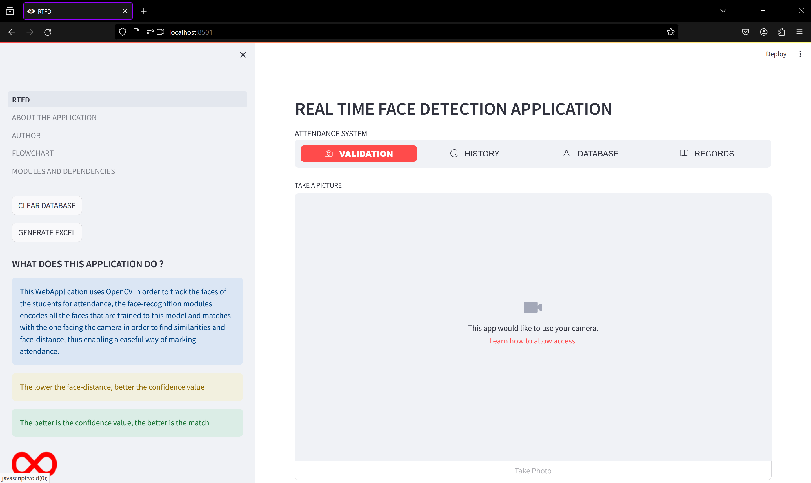
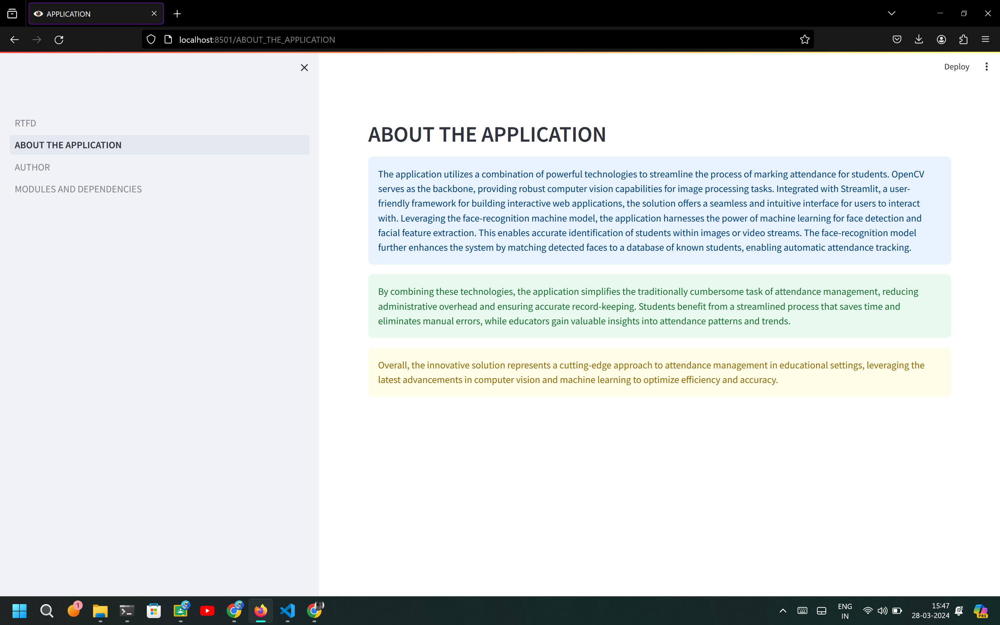
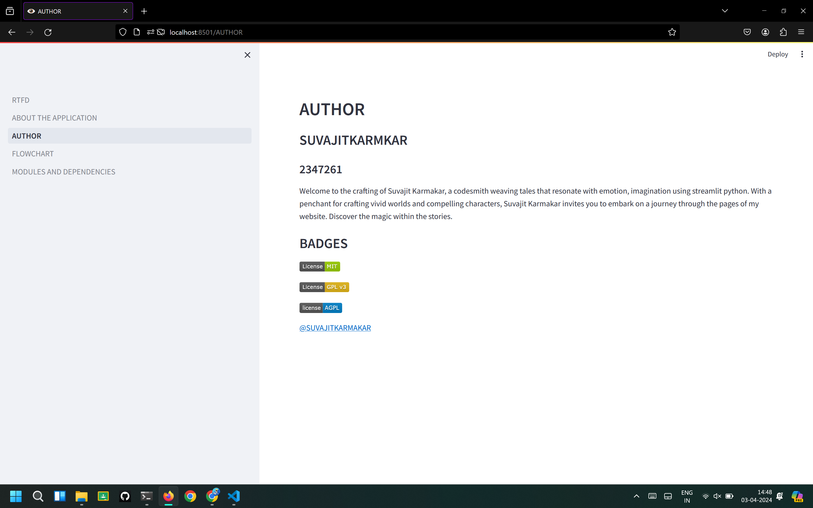
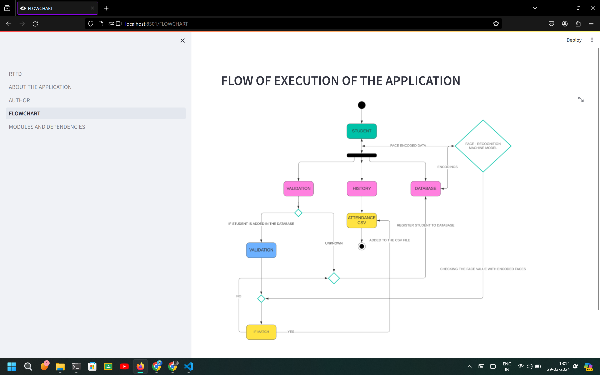
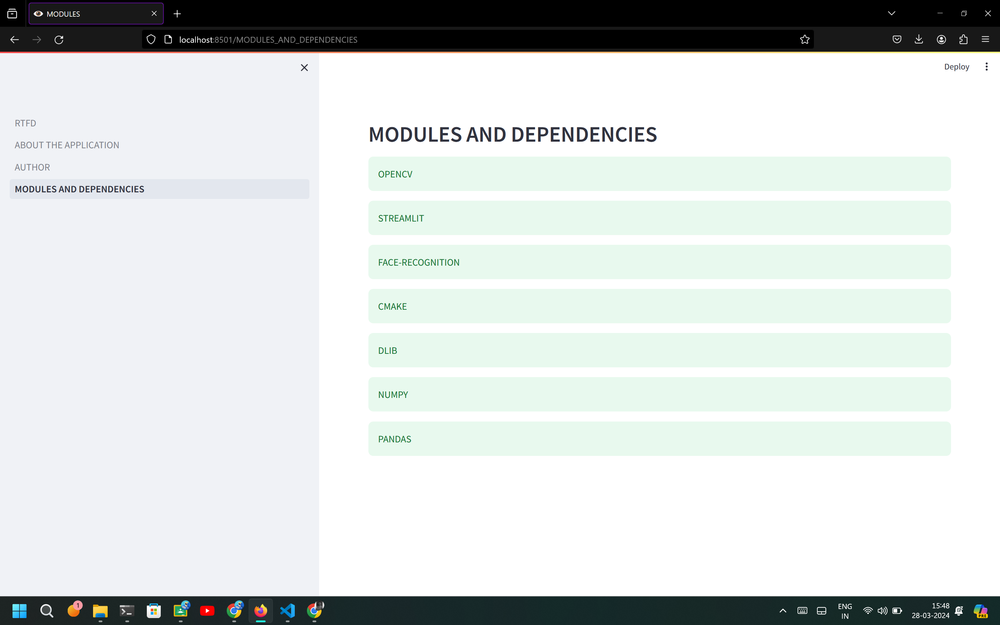

# REAL TIME ATTENDANCE SYSTEM 
## AN OPENCV PROJECT 

*The real-time face recognition project utilizes OpenCV and machine learning algorithms to detect and recognize faces in real-time. The application is robust and flexible and allows detection and capture of face for real-time attendance system.*


## INSTALLATION OF THIS PROJECT 
- Perform git clone for downloading this project and run at local environments.
- Fork this project to become an active contributor of this project.


#### RUNNING IN LOCAL ENVIRONMENT
###### STEP : 1
```bash
pip insall virtualenv
```

###### STEP : 2
```bash
virtual env
```

###### STEP : 3
```bash
cd env
```

###### STEP : 4
###### Paste the cloned components inside the 'env' folder

###### STEP : 5
```bash
.env\Scripts\activate
```

###### STEP : 6
```bash
pip install streamlit 
pip install numpy
pip install pandas
pip install face-recognition
pip install cmake
pip install dlib
pip install cv2
```

###### STEP : 1
###### Running the project
```bash
streamlit run RTFD.py
```


## ABOUT THE MODULES AND DEPENDENCIES
#### OPENCV
*OpenCV, short for Open Source Computer Vision Library, is a versatile open-source library for computer vision and image processing tasks. It offers a wide range of functionalities including image and video manipulation, object detection and recognition, facial recognition, and motion tracking. With support for various programming languages like C++, Python, and Java, OpenCV enables developers to create powerful applications in fields such as robotics, augmented reality, medical imaging, and more. Its comprehensive documentation, extensive community support, and compatibility with multiple platforms make it a popular choice for both hobbyists and professionals in the computer vision domain.*

#### STREAMLIT
*Streamlit is an open-source Python library used for building interactive web applications with minimal effort. With Streamlit, developers can create intuitive and visually appealing interfaces for data exploration, machine learning models, and more, directly from Python scripts. The library simplifies the process by automatically handling tasks like layout design, widget creation, and reactive updates. Streamlit's intuitive API allows users to quickly prototype ideas and share insights with others. It's widely appreciated for its simplicity, flexibility, and seamless integration with popular data science libraries like Pandas, Matplotlib and TensorFlow.*

#### FACE-RECOGNITION
*The face recognition module is a computer vision technology designed to identify and verify individuals based on their facial features. It works by analyzing patterns, such as the relative positions, sizes, and shapes of facial landmarks, and comparing them against a database of known faces. Advanced algorithms, such as convolution neural networks (CNNs), are often employed to enhance accuracy and robustness. This technology finds applications in security systems, access control, law enforcement, and personalized user experiences.*

#### CMAKE
*CMake is a cross-platform build system that helps manage the build process of software projects. It utilizes a simple scripting language to define project configurations and generate platform-specific build files, such as Makefiles or IDE project files. CMake simplifies the process of building software across different operating systems and environments by abstracting the build process from the underlying platform details. It supports various compilers, tools, and environments, providing developers with a consistent and efficient way to build and manage their projects. Additionally, CMake promotes modularity and reusability through its modular design and support for package management systems like CPack.*

#### DLIB
*The dlib library, particularly its model, is a powerful tool for machine learning and computer vision tasks. It offers pre-trained models for facial detection, facial landmark detection, object tracking, and more. The dlib model utilizes a combination of deep learning techniques and traditional computer vision algorithms, providing robust and accurate results. It's widely used in various applications including facial recognition systems, emotion detection, and object tracking in real-time video streams. With its versatility and efficiency, the dlib model remains a popular choice for developers and researchers in the field of computer vision and machine learning.*

#### NUMPY
*NumPy is a powerful Python library for numerical computing, offering support for arrays, matrices, and mathematical functions. It provides efficient data structures for handling large datasets and performing operations such as sorting, reshaping, and statistical analysis. NumPy's array operations are optimized for speed, making it a cornerstone for scientific computing and data analysis tasks. Its seamless integration with other Python libraries like SciPy and Matplotlib enhances its versatility for various applications including machine learning, image processing, and computational physics. Overall, NumPy serves as a fundamental tool for high-performance computation and data manipulation in Python programming.*

#### PANDAS
*Pandas is a powerful Python library designed for data manipulation and analysis. It provides easy-to-use data structures and functions, primarily DataFrame, which resembles a spreadsheet with rows and columns. Pandas allows for efficient handling of large datasets, offering functionalities for data cleaning, exploration, transformation, and visualization. It seamlessly integrates with other libraries like NumPy and Matplotlib, making it a cornerstone tool for data scientists and analysts. With its intuitive syntax and comprehensive documentation, Pandas simplifies complex data tasks, enabling users to extract valuable insights and drive informed decisions in various domains, including finance, research, and machine learning.*


## BADGES
[](https://choosealicense.com/licenses/mit/)
[](https://opensource.org/licenses/)
[](http://www.gnu.org/licenses/agpl-3.0)


## FEATURES
- Real-time face detection for attendance.
- Light weight and fast.
- High success rates for proper detection of the faces.


## SCREENSHOTS







## AUTHORS
- [@SUVAJITKARMAKAR](https://github.com/SUVAJITKARMAKAR)


## FEEDBACK
If you have any feedback about this project or any queries, please reach out to me at suvajit.karmakar@mca.christuniversity.in

